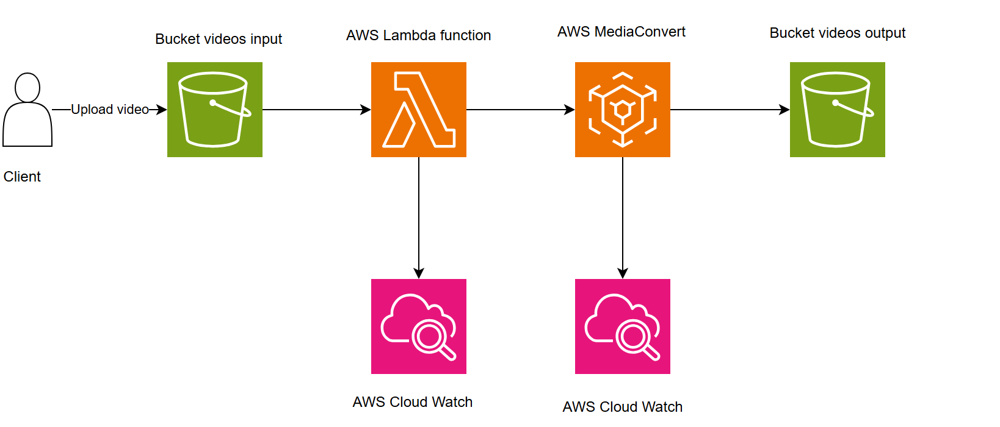

# AWS Media Convert Service

# Table of contents

- [AWS Media Convert Service](aws-media-convert-service)

  - [What is AWS Media Convert ?](what-is-media-convert-?)

  - [Why AWS Media Convert ?](why-aws-media-convert-?)

  - [Workflow convert video](workflow-convert-video)

  - [Steps config on AWS](steps-config-on-aws)

  - [Jobs configuration for converting video](jobs-configuration-for-converting-video)

    - [Input configuration](input-configuration)
    - [Output configuration](output-configration)
    - [Video scaling behavior and aspect ratios](video-scaling-behavior-and-aspect-ratios)
    - [QVBR Control Mode](qvbr-control-mode)

  - [Implement lambda function for creating job](implement-lambda-function-for-creating-job)

## What is AWS Media Convert?

AWS MediaConvert is a file-based video transcoding service that provides scalable video processing for content owners and distributors with media libraries of any size.

The service operates as a fully managed, pay-as-you-go model with no upfront fees, making it suitable for any size workflow.

## Why AWS Media Convert ?

In this document we describe the usage of AWS Media Convert when we are working in a project that need to upload videos and handling quality of the video. We need to proccess for splitting the video to various resolutions and we can stream each of part of the video to client using HLS protocol.

**Multi-resolution transcoding for adaptive streaming**: Our primary use case involves converting videos to multiple resolutions (240p, 360p, 480p, 720p, 1080p) and transforming them to m3u8 format for HTTP Live Streaming (HLS). This enables:

- Adaptive bitrate streaming based on viewer's connection quality
- Reduced buffering and improved viewing experience across various devices
- Better bandwidth utilization for viewers
- Faster startup times for video playback

## Workflow convert video in this document

- **Step 1**: Client upload a video to s3 bucket video input through a upload signed url.
- **Step 2**: S3 bucket video input is configured trigger an event to lambda function. Lambda will receive information about bucket name and source key of the file.
- **Step 3**: AWS lambda function received input file and load json config for MediaConvert then calling sdk to create a job on it. Logs about creating job success or failed will be available on AWS CloudWatch.
- **Step 4**: Job created on MediaConvert is excuted in a queue and output videos will be saved to S3 bucket video outputs. Logs about status job can be viewed in CloudWatch.

## Steps config on AWS

To configure AWS MediaConvert for your video processing needs:

1. **Create S3 buckets**:

   - Create an input bucket for source videos
   - Create an output bucket for processed videos

2. **Create Lambda function**:
   -
3. **Set up IAM permissions**:

   - Create an IAM role that allows MediaConvert to access your S3 buckets
   - Ensure proper permissions for reading from input and writing to output

4. **Configure MediaConvert endpoints**:

   - Choose between on-demand or reserved transcode slots based on your workload
   - Select the appropriate region for your workflow

5. **Create job templates** (optional):

   - Define reusable job templates for consistent processing
   - Configure output presets for your common conversion scenarios

6. **Set up event notifications** (optional):
   - Configure SNS or CloudWatch Events to receive job status notifications
   - Integrate with other AWS services as needed

## Jobs configuration for converting video

### Input configuration

Input configuration defines how MediaConvert interprets your source content:

- **Input selectors**: Define which audio, video, and caption tracks to include
- **Input clipping**: Optionally specify time ranges to process
- **Deinterlacing**: Configure settings for interlaced content
- **Decoding settings**: Adjust parameters for proper source decoding
- **Audio selectors**: Map audio tracks from the source to outputs
- **Caption selectors**: Configure caption sources and formats

### Output configuration

Output configuration determines the format and characteristics of your processed videos:

- **Output group types**: Choose between HLS, DASH, File Group, etc. For our HLS streaming use case:

  - Select Apple HLS output group
  - Configure segment duration (typically 6-10 seconds)
  - Set up playlist settings and manifest generation

- **Video encoding settings**:

  - Codec selection (H.264/AVC, H.265/HEVC, etc.)
  - Resolution ladder (240p, 360p, 480p, 720p, 1080p)
  - Bitrate allocation strategy
  - Frame rate configuration
  - GOP structure and reference frames

- **Audio encoding settings**:

  - Audio codecs (AAC, Dolby Digital, etc.)
  - Sample rate and channels
  - Bitrate allocation

- **Advanced features**:
  - HDR/SDR conversion
  - Content encryption
  - Manifest customization

### Video scaling behavior and aspect ratios

Managing aspect ratios is crucial for proper video display across devices:

- **Scaling policies**: Choose between Stretch to Output, Fit, Fill, or Crop
- **Padding control**: Configure letterboxing or pillarboxing behavior
- **Aspect ratio conversion**: Handle different source and output aspect ratios
- **Resolution-specific considerations**: Maintain quality while scaling to different resolutions

### QVBR Control Mode

Quality-Defined Variable Bitrate (QVBR) allows optimizing file size while maintaining consistent quality:

- **QVBR vs CBR vs VBR**: Understand the differences and when to use each
- **Quality level setting**: Configure the target quality level (1-10)
- **Max bitrate**: Set upper limits for bitrate allocation
- **Single-pass vs multi-pass encoding**: Balance between quality and processing time
- **Resolution-specific settings**: Adjust QVBR parameters for different output resolutions

## Implement lambda function for creating job

AWS Lambda can automate MediaConvert job creation when new videos are uploaded:

- **Event-driven architecture**: Trigger Lambda when new files arrive in S3
- **SDK implementation**: Use the AWS SDK to interact with MediaConvert API
- **Dynamic job configuration**: Generate job settings based on file metadata
- **Error handling and retries**: Ensure robust processing for all inputs
- **Monitoring and logging**: Track job progress and troubleshoot issues
- **Cost optimization**: Implement strategies to minimize processing costs

Example Lambda implementation patterns include:

- Simple job submission with fixed settings
- Dynamic template selection based on input characteristics
- Customized output paths and naming conventions
- Integration with metadata services
- Post-processing notification systems
